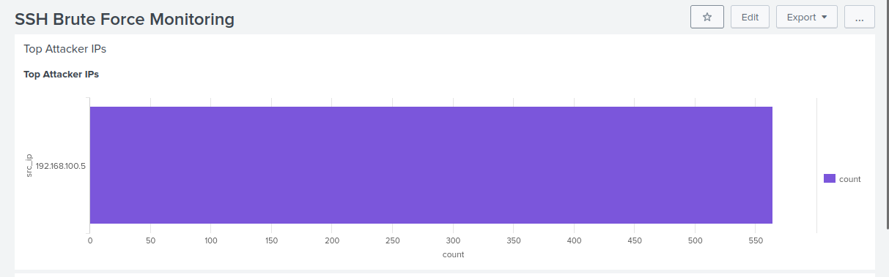

# SentinelSIEM – SOC Detection Engineering Lab

## Overview

SentinelSIEM is a hands-on cybersecurity project simulating a real-world Security Operations Center (SOC) using Splunk.

It demonstrates the complete security lifecycle:

**Attack Simulation → Log Ingestion → Detection → Alerting → Investigation**

---

## Project Highlights

### SSH Brute Force Detection


### SOC Dashboard (Attack Monitoring)


### Triggered Alert


---

## Lab Architecture

- **Attacker:** Kali Linux  
- **Target:** Ubuntu Server  
- **SIEM:** Splunk Enterprise  
- **Network:** 192.168.100.0/24  

---

# Scenario 1: SSH Brute Force Attack

### Attack
- Tool: Hydra  
- Target: SSH (Port 22)  
- Result: Multiple failed login attempts  

### Detection
- Log Source: `/var/log/auth.log`  
- Method: Regex-based field extraction + aggregation  

### Alerting
- Threshold-based detection  
- Automated alert triggered  

### Investigation
- Source IP identification  
- Target user analysis  
- Timeline visualization  

---

# Scenario 2: Port Scan Detection

### Attack
- Tool: Nmap  
- Scan Type: TCP SYN Scan  

### Detection
- Log Source: `/var/log/syslog` (UFW logs)  
- Method: Aggregation of blocked connection attempts  

### Dashboard Insights
- Top scanning IPs  
- Most targeted ports  
- Attack timeline  

### Alerting
- Detection of abnormal scan patterns  
- Automated alert triggered  

---

## Key Skills Demonstrated

- SIEM (Splunk)  
- Detection Engineering  
- Log Analysis  
- Incident Response  
- Network Security Monitoring  
- Attack Simulation (Hydra, Nmap)  

---

## Project Structure

```
SentinelSIEM/
├── attacks/
├── detection-rules/
├── dashboards/
├── reports/
├── configs/
├── assets/
├── data-ingestion/
├── lab-setup/
```

---

## Outcome

This project demonstrates real-world SOC capabilities:

- Detecting authentication attacks  
- Identifying network reconnaissance  
- Building detection rules  
- Automating alerts  
- Investigating incidents  

---

## Author

Meet Dave  
MSc Cyber Security – University of Surrey
