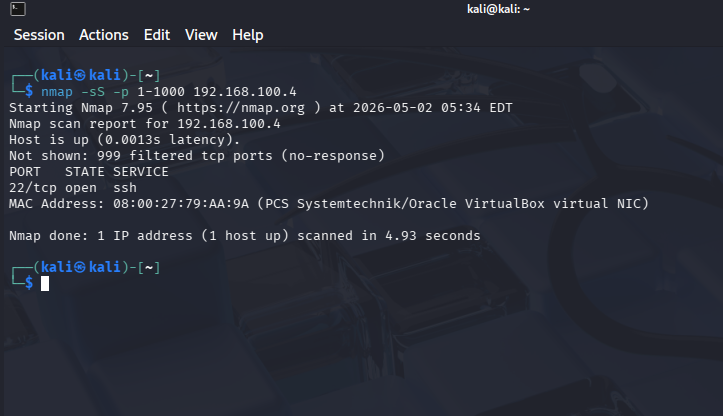

# Port Scan Attack (Nmap)

## Overview

This attack simulates reconnaissance activity by scanning multiple ports on the target system to identify open or filtered services.

Port scanning is typically the first phase of an attack, allowing attackers to map the target's exposed surface.

---

## Environment

- Attacker: Kali Linux (192.168.100.5)
- Target: Ubuntu Server (192.168.100.4)

---

## Tool Used

- Nmap (Network Mapper)

---

## Attack Type

- TCP SYN Scan (Stealth Scan)

---

## Command Used

```
nmap -sS -p 1-1000 192.168.100.4
```

---

## Evidence



---

## Attack Behavior

- Sends SYN packets to multiple ports
- Attempts to identify open, closed, or filtered ports
- Generates high volume of connection attempts in short time

---

## Observed Output

- Most ports reported as filtered (due to firewall)
- Limited visibility of open ports (e.g., SSH on port 22)

---

## Logs Generated

- UFW firewall logs (`/var/log/syslog`)
- Blocked connection attempts recorded with source IP and destination port

---

## Purpose

This attack is used to:

- Simulate attacker reconnaissance behavior
- Generate network-level logs
- Enable detection of scanning patterns in SIEM

---

## Key Insight

Port scanning generates a large number of connection attempts across different ports, making it detectable through firewall log analysis and aggregation techniques.