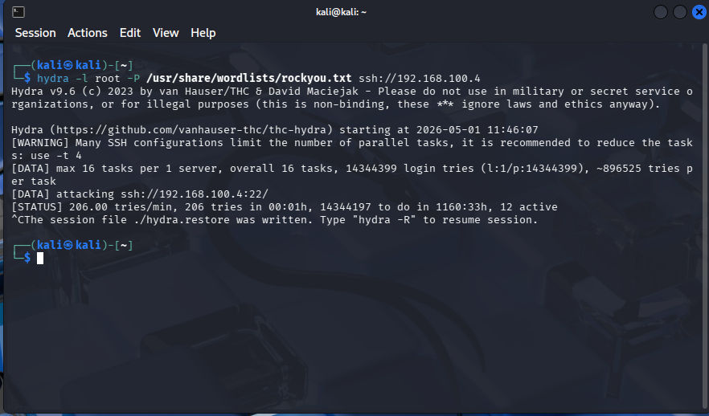

# SSH Brute Force Attack

## Setup

- Attacker: Kali Linux (192.168.100.5)
- Target: Ubuntu Server (192.168.100.4)

---

## Tool Used

Hydra

---

## Command

hydra -l root -P /usr/share/wordlists/rockyou.txt ssh://192.168.100.4

---

## Evidence

---

## Outcome

- Multiple failed SSH login attempts generated
- Logs recorded in /var/log/auth.log
- Used later for detection in Splunk