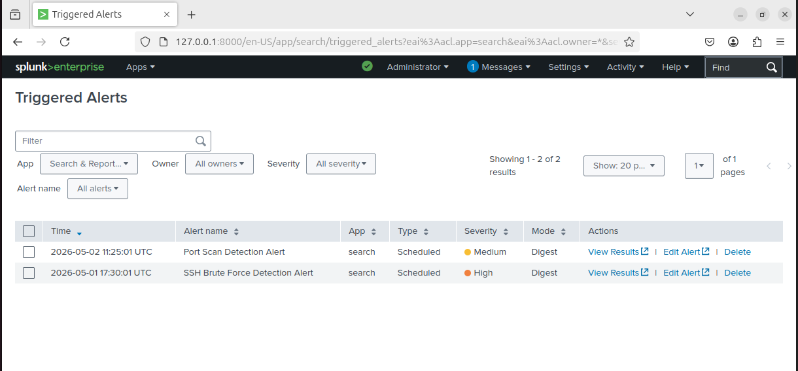

# Port Scan Alert Configuration

## Overview

This alert detects port scanning activity by monitoring repeated blocked connection attempts from a single source IP.

---

## Detection Query

```
index=network_logs "UFW BLOCK"
| rex "SRC=(?<src_ip>\d+.\d+.\d+.\d+)"
| stats count by src_ip
| where count > 50
```

---

## Alert Configuration

- Type: Scheduled  
- Frequency: Every 5 minutes  
- Time Window: Last 15 minutes  
- Trigger Condition: Number of results > 0  

---

## Result

The alert successfully triggered when a port scan was simulated from the attacker machine.

---

## Evidence



---

## Key Insight

Port scanning generates a high number of blocked connection attempts, which can be automatically detected using SIEM alerting.