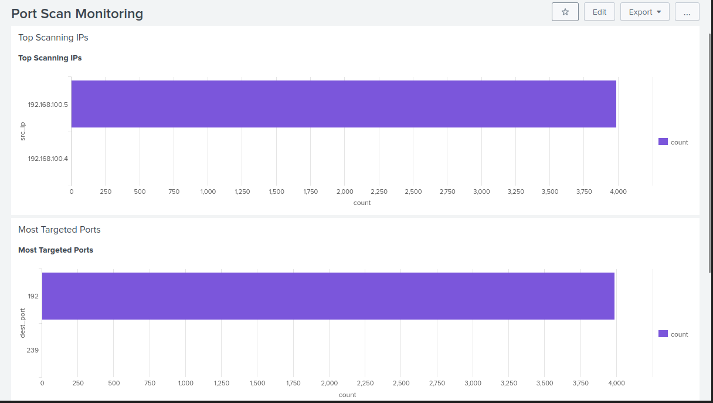

# Port Scan Dashboard

## Overview

This dashboard visualizes port scanning activity detected using firewall logs.

---

## Panels

### 1. Top Scanning IPs

Displays IP addresses generating the highest number of blocked connection attempts.

---

### 2. Most Targeted Ports

Shows which ports are being scanned most frequently.

---

## Evidence

---

## Key Insight

Port scan behavior can be identified through repeated connection attempts across multiple ports from a single source IP.