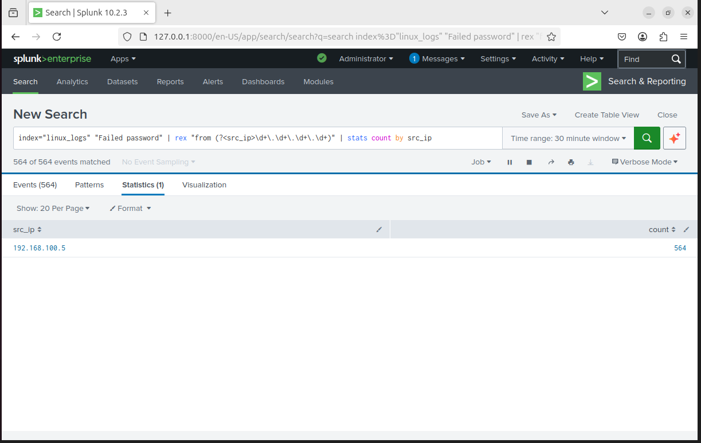

# SSH Brute Force Detection

## Overview

This detection identifies SSH brute-force attacks by analyzing repeated failed login attempts from a single source IP.

---

## Log Source

- File: /var/log/auth.log
- Index: linux_logs
- Sourcetype: linux_secure

---

## Detection Logic (Splunk SPL)

index="linux_logs" "Failed password" | rex "from (?<src_ip>\d+.\d+.\d+.\d+)" | stats count by src_ip

---

## Analysis

The query extracts the source IP address from authentication logs and counts the number of failed login attempts per IP.

This helps identify suspicious behavior such as repeated login failures originating from a single host.

---

## Result

- Attacker IP detected: 192.168.100.5
- High number of failed login attempts observed

This confirms successful simulation and detection of a brute-force attack.

---

## Evidence
The following screenshot shows detection of brute-force attempts from the attacker machine:

---

## Key Insight

Raw logs must be parsed using field extraction (regex) to enable meaningful detection.

Without extraction, detection logic would fail due to missing structured fields.
