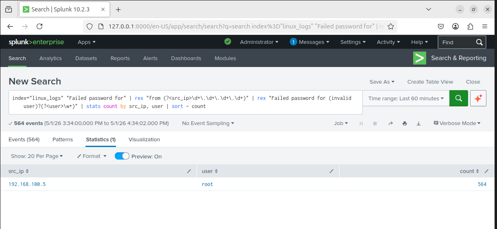
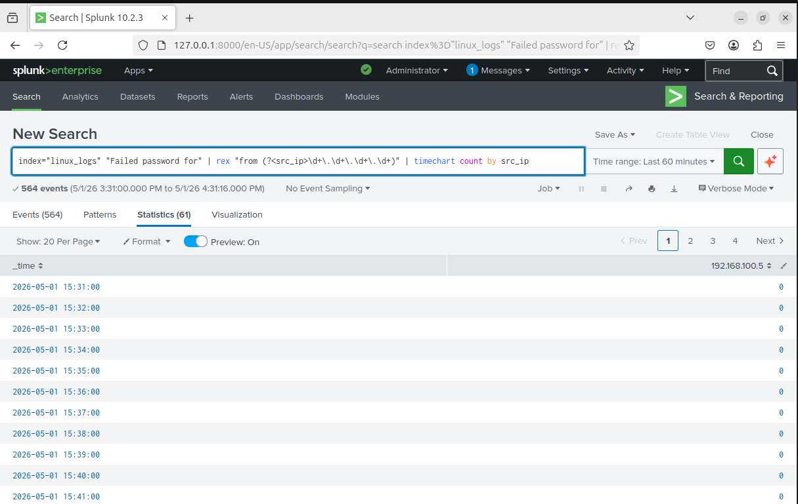

# SSH Brute Force Detection

## Overview

This detection identifies SSH brute-force attacks by analyzing repeated failed login attempts from a single source IP address.

It demonstrates how authentication logs can be leveraged to detect credential-based attacks using Splunk.

---

## Log Source

- File: /var/log/auth.log  
- Index: linux_logs  
- Sourcetype: linux_secure  

---

## Detection Logic (Splunk SPL)

```
index="linux_logs" "Failed password for"
| rex "from (?<src_ip>\d+\.\d+\.\d+\.\d+)"
| stats count by src_ip
```

---

## Analysis

The query extracts the source IP address from raw authentication logs using regex and aggregates failed login attempts per IP.

This enables identification of suspicious behavior where a single source generates excessive authentication failures.

---

## Result

- Attacker IP detected: 192.168.100.5  
- High number of failed login attempts observed  

This confirms successful simulation and detection of a brute-force attack originating from the attacker machine.

---

## Enhanced Detection

### Detection with User Context

```
index="linux_logs" "Failed password for"
| rex "from (?<src_ip>\d+\.\d+\.\d+\.\d+)"
| rex "Failed password for (invalid user )?(?<user>\w+)"
| stats count by src_ip, user
| sort - count
```

This enhancement provides visibility into both:
- Attacker IP address  
- Targeted user accounts  

This helps analysts understand attacker behavior and targeting patterns.

---

### Attack Timeline Visualization

```
index="linux_logs" "Failed password for"
| rex "from (?<src_ip>\d+\.\d+\.\d+\.\d+)"
| timechart count by src_ip
```

This allows visualization of attack activity over time, making it easier to identify spikes and attack patterns.

---

## Evidence

### Detection Output

The following screenshot shows detection of brute-force attempts from the attacker machine:


---

### Enhanced Detection (User + IP)



---

### Attack Timeline



---

## Key Insights

- Raw logs must be parsed using regex to extract meaningful fields  
- Detection accuracy improves when focusing on structured patterns  
- Aggregation helps identify attack behavior at scale  
- Visualization enables better investigation and understanding of attack patterns  

---

## Conclusion

This detection demonstrates how brute-force attacks can be identified using centralized log analysis in a SIEM environment.

It highlights the importance of:
- log parsing  
- detection engineering  
- behavioral analysis  

in modern SOC operations.
