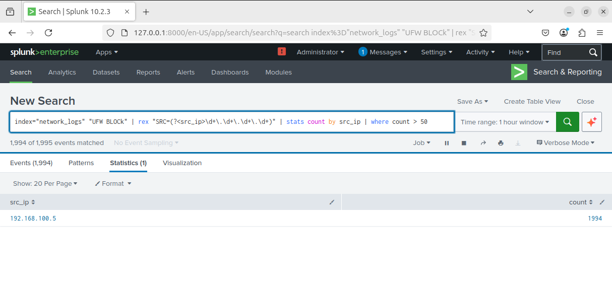

# Port Scan Detection

## Overview

This detection identifies port scanning activity by analyzing repeated blocked connection attempts from a single source IP.

---

## Log Source

- File: /var/log/syslog
- Index: network_logs
- Source: UFW firewall logs

---

## Detection Logic (Splunk SPL)

index=network_logs "UFW BLOCK"
| rex "SRC=(?<src_ip>\d+.\d+.\d+.\d+)"
| stats count by src_ip
| where count > 50

---

## Analysis

The query extracts the source IP from firewall logs and counts the number of blocked connection attempts.

A high number of blocked attempts from a single IP indicates potential port scanning activity.

---

## Result

- Attacker IP detected: 192.168.100.5
- High volume of blocked connection attempts observed

---

## Evidence

---

## Key Insight

Port scanning generates multiple connection attempts across different ports, which can be detected by analyzing firewall logs.
