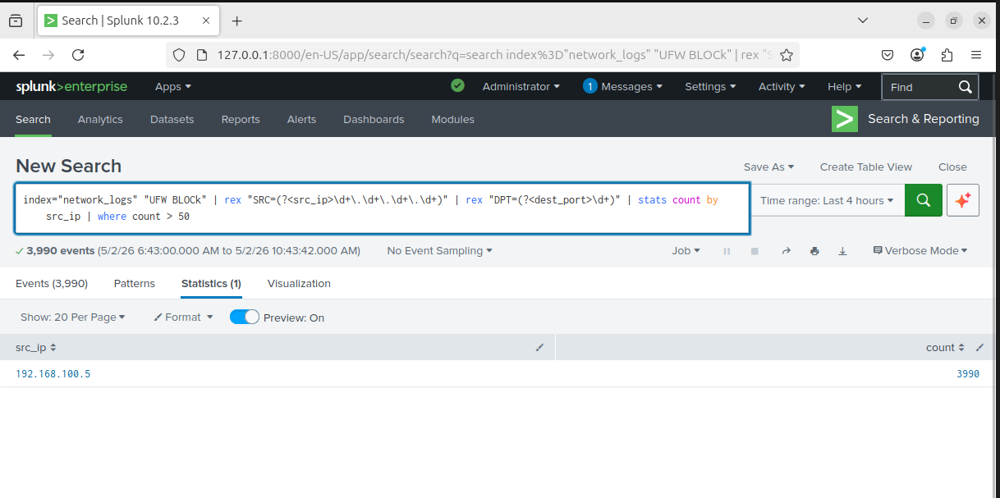

# Port Scan Detection

## Overview

This detection identifies port scanning activity by analyzing repeated blocked connection attempts from a single source IP using UFW firewall logs.

---

## Log Source

- File: /var/log/syslog  
- Index: network_logs  
- Source: UFW firewall logs  

---

## Detection Logic (Splunk SPL)

```
index=network_logs "UFW BLOCK"
| rex "SRC=(?<src_ip>\d+\.\d+\.\d+\.\d+)"
| stats count by src_ip
| where count > 50
```

---

## Analysis

The query extracts the source IP from firewall logs and counts the number of blocked connection attempts.

A high number of blocked attempts from a single IP indicates potential port scanning activity, as scanners attempt connections across multiple ports.

---

## Result

- Attacker IP detected: 192.168.100.5  
- High volume of blocked connection attempts observed  

This confirms successful simulation and detection of a port scanning attack.

---

## Enhanced Detection

### Port-Level Visibility

```
index=network_logs "UFW BLOCK"
| rex "SRC=(?<src_ip>\d+\.\d+\.\d+\.\d+)"
| rex "DPT=(?<dest_port>\d+)"
| stats count by src_ip, dest_port
| sort - count
```

This enhancement provides visibility into which destination ports are being targeted during the scan.

---

## Evidence

### Detection Output


---

### Enhanced Detection (Port Analysis)



---

## Key Insights

- Firewall logs are critical for detecting network-level attacks  
- Port scans generate multiple blocked connection attempts  
- Aggregation helps identify abnormal behavior patterns  
- Port-level analysis improves investigation capability  

---

## Conclusion

This detection demonstrates how port scanning activity can be identified using firewall logs and SIEM analysis.

It highlights the importance of:
- network monitoring  
- log ingestion  
- behavioral detection  

in modern SOC environments.
