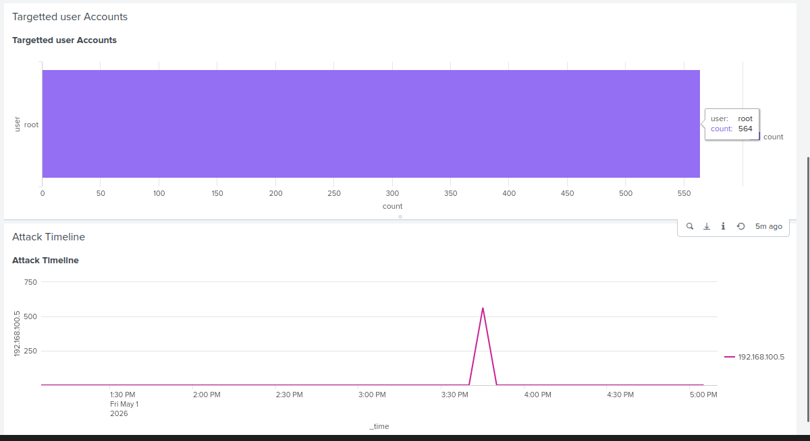
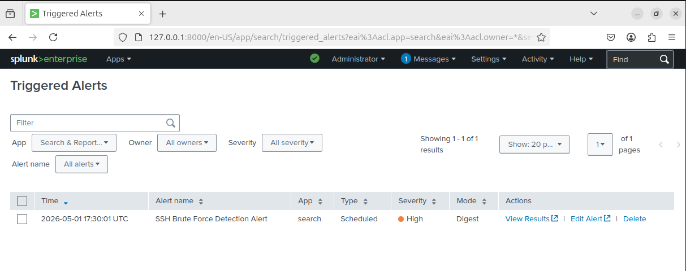

# Incident Report: SSH Brute Force Attack

## Overview

This report documents a simulated SSH brute-force attack detected within the lab environment using Splunk SIEM.

The attack was launched from an attacker machine and identified through analysis of authentication logs.

---

## Environment

- Attacker: Kali Linux (192.168.100.5)
- Target: Ubuntu Server (192.168.100.4)
- SIEM: Splunk Enterprise

---

## Attack Details

- Attack Type: SSH Brute Force
- Tool Used: Hydra
- Target Service: SSH (Port 22)

### Command Used

hydra -l root -P /usr/share/wordlists/rockyou.txt ssh://192.168.100.4

---

## Detection

The attack was detected using Splunk by analyzing failed login attempts in authentication logs.

### Detection Query

index="linux_logs" "Failed password for"
| rex "from (?<src_ip>\d+.\d+.\d+.\d+)"
| stats count by src_ip
| where count > 20

---

## Findings

- Source IP: 192.168.100.5
- Target User: root
- High volume of failed login attempts detected
- Attack activity confirmed through log analysis and visualization

---

## Evidence

### Detection Output

---

### Dashboard Visualization

---

### Triggered Alert

---

## Impact

- Unauthorized access attempts detected
- Potential risk of credential compromise
- System remained secure (no successful login)

---

## Response

- Attack identified via SIEM detection rule
- Alert triggered for SOC visibility
- Investigation performed using dashboard and log analysis

---

## Key Takeaways

- Brute-force attacks can be detected using authentication logs
- Field extraction is essential for accurate detection
- Alerting enables real-time threat visibility
- Dashboards improve investigation efficiency

---

## Conclusion

This incident demonstrates the effectiveness of SIEM-based detection in identifying and responding to brute-force attacks in a controlled environment.
